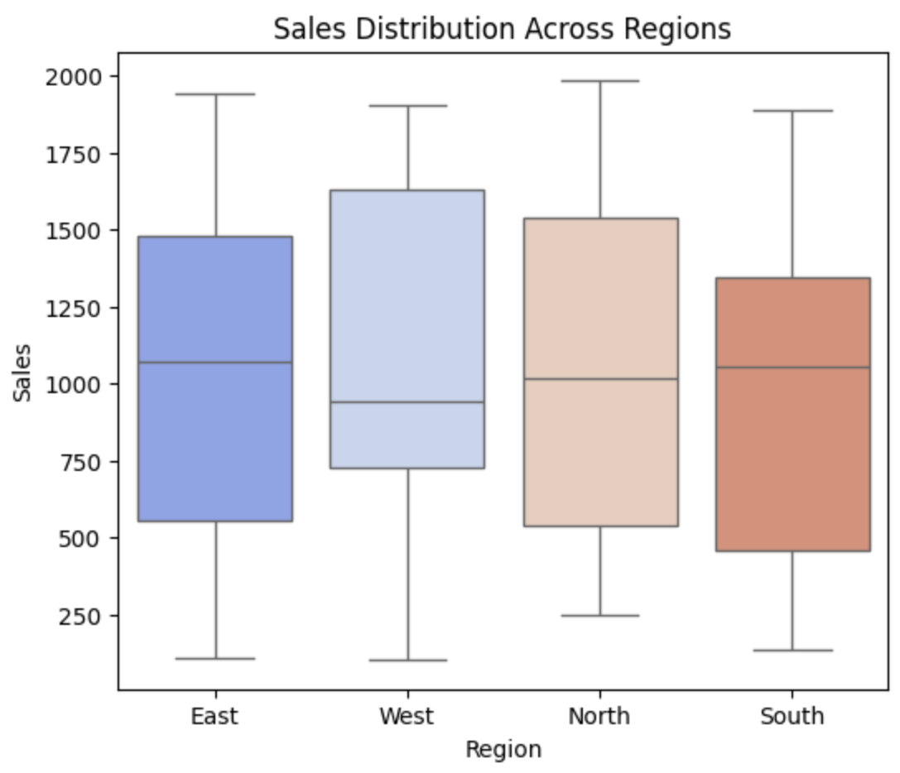
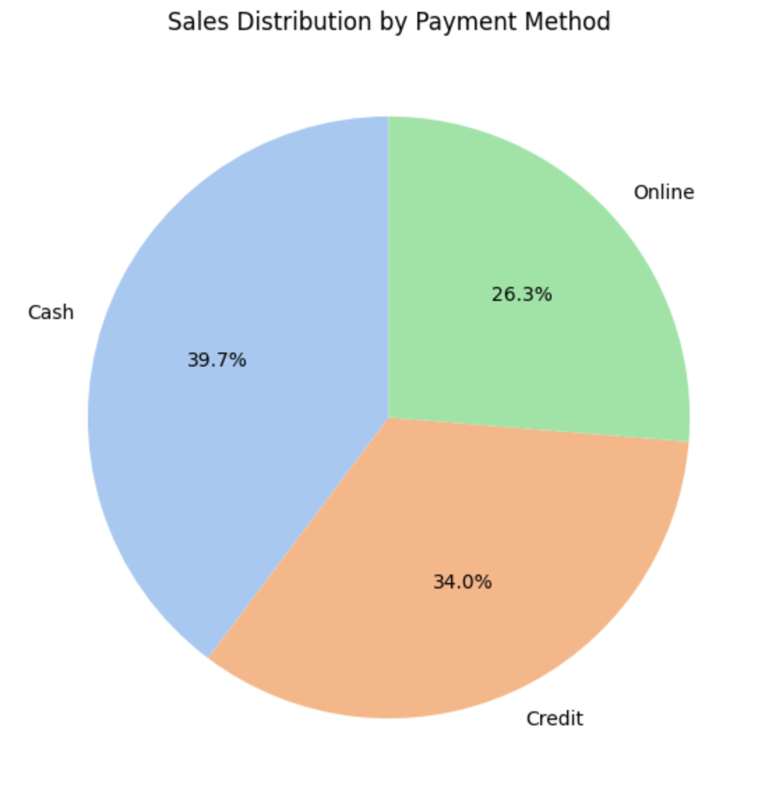

# Analyze Excel Files with Pandas
A Python-based data analysis tool for **Excel**, using **Pandas** for data processing and **Seaborn/Matplotlib** for visualization.


## Set Up data
Run the script to create "sample_data.xlsx":
```sh
python excel.py
```

## Usage
Open notebook and run the cells step by step:

<br>



<br>




## Concept
[Visit (takehika0129.github.io)](https://takehika0129.github.io/takehika-github-pages/reviews/prototype20.html).


## Requirements
- Python >= 3.6
- `openpyxl`
- `pandas`
- `numpy`
- `matplotlib`
- `seaborn`


Install dependencies:
```sh
pip install -r requirements.txt
```

## License
You are free to use this code for personal and educational purposes. Commercial use and redistribution are not allowed.
